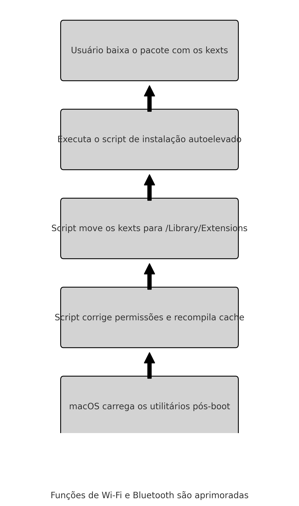
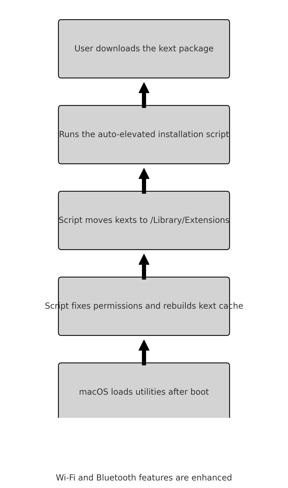

# Kexts Auxiliares

Este repositório reúne utilitários de Wi-Fi e Bluetooth para macOS,
além de scripts de instalação fáceis de usar.

## Estrutura

- `kexts/` – script de instalação e kexts auxiliares
- `docs/pt_BR/` – documentação em Português (README, FAQ e fluxograma)
- `docs/en/` – documentation in English (README, FAQ and flowchart)

### Rápido começo

Execute o instalador a partir da pasta `kexts`:

```bash
./kexts/instalar_auxiliares_autoelevado.command
```

Consulte a documentação no idioma desejado para detalhes adicionais.

## Fluxograma / Flowchart



