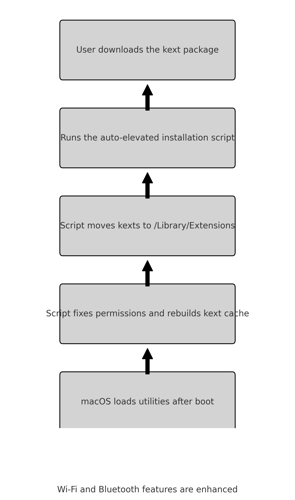

# 📦 Auxiliary Kexts — Hackintosh and Beyond

This repository provides two “auxiliary kexts” used to **improve the stability and functionality of Wi-Fi and Bluetooth connections** on **Hackintosh systems** and even on **real Macs**:

- `AirPortUtility.kext`
- `BluetoothFileExchange.kext`

Despite the `.kext` extension, these files are actually **Apple utility apps packaged as kexts**, activating specific internal services after macOS boots.

## ✅ Purpose

| Kext | Main Function |
|------|---------------|
| `AirPortUtility.kext` | Reactivates advanced AirPort/Wi-Fi features, including support for legacy base stations, connection events, mesh network sync, and AirPlay triggers |
| `BluetoothFileExchange.kext` | Restores OBEX protocol support (Bluetooth File Transfer) and improves session stability |

## 🔧 Recommended Installation

⚠️ **Do not place these kexts in the EFI folder** — they are not kernel drivers.

### Install using the auto-elevated script:

```bash
./instalar_auxiliares_autoelevado.command
```

Enter your password when prompted and reboot your system.

## 📁 Install Location

```bash
/Library/Extensions
```

## 🖥️ Compatibility

| Platform    | Supported |
|-------------|-----------|
| Hackintosh  | ✅ Fully compatible |
| Real Macs   | ✅ Reactivates legacy support |
| EFI (OpenCore/Clover) | ❌ Ineffective — not loaded at preboot |

## 📂 Package Contents

```
📁 Kexts_Auxiliares/
├── instalar_auxiliares_autoelevado.command
├── AirPortUtility.kext
└── BluetoothFileExchange.kext
```
## Installation Flowchart


